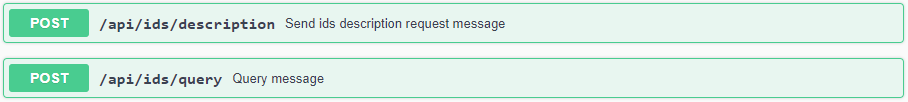

# Consuming Data
{: .fs-9 }

See how to consume data with the Dataspace Connector.
{: .fs-6 .fw-300 }

---

The connector provides an endpoint for requesting its self-description.
The self-description is returned as JSON-LD and contains several information about the running
connector instance. This includes e.g. the title, the maintainer, the IDS Informodel version, and
the resource catalog. At the public endpoint `/`, the resource catalog is not displayed. It can only
be accessed with admin credentials at `GET /api/connector` or by sending an IDS description request
message as explained [here](consumer.md#step-1-request-a-connectors-self-description)).


## Step by Step

For requesting data and metadata as a data consumer, two endpoints are provided. A description
request is used for requesting the metadata and a contract request is used for handling out 
contract agreements to then be able to retrieve raw data from a data provider.



---

**Important**: Note that the `/api/ids/data` endpoint may not be valid for other connector 
implementations. Check at which endpoint the data provider expects the IDS multipart messages in 
advance.

---

### Step 1: Request a Connector's Self-description

For sending a `POST` request, two parameters have to be set: the recipient and the requested element.
As, in a first step, the data consumer only wants to read the self-description to get a list of
resources, the requested element needs to be left empty.

If the request is successful, the response body will contain a `BaseConnector` with a single catalog 
or list of catalogs. 

````json
{
  "@context" : {
    "ids" : "https://w3id.org/idsa/core/",
    "idsc" : "https://w3id.org/idsa/code/"
  },
  "@type" : "ids:BaseConnector",
  "@id" : "https://w3id.org/idsa/autogen/baseConnector/7b934432-a85e-41c5-9f65-669219dde4ea",
  "ids:publicKey" : {
    "@type" : "ids:PublicKey",
    "@id" : "https://w3id.org/idsa/autogen/publicKey/78eb73a3-3a2a-4626-a0ff-631ab50a00f9",
    "ids:keyType" : {
      "@id" : "idsc:RSA"
    },
    "ids:keyValue" : "[...]"
  },
  "ids:version" : "5.0.0",
  "ids:description" : [ {
    "@value" : "IDS Connector with static example resources hosted by the Fraunhofer ISST",
    "@type" : "http://www.w3.org/2001/XMLSchema#string"
  } ],
  "ids:title" : [ {
    "@value" : "Dataspace Connector",
    "@type" : "http://www.w3.org/2001/XMLSchema#string"
  } ],
  "ids:securityProfile" : {
    "@id" : "idsc:BASE_SECURITY_PROFILE"
  },
  "ids:maintainer" : {
    "@id" : "https://www.isst.fraunhofer.de/"
  },
  "ids:resourceCatalog" : [ {
    "@type" : "ids:ResourceCatalog",
    "@id" : "https://localhost:8080/api/catalogs/eda0cda2-10f2-4b39-b462-5d4f2b1bb758"
  } ],
  "ids:curator" : {
    "@id" : "https://www.isst.fraunhofer.de/"
  },
  "ids:hasDefaultEndpoint" : {
    "@type" : "ids:ConnectorEndpoint",
    "@id" : "https://w3id.org/idsa/autogen/connectorEndpoint/e5e2ab04-633a-44b9-87d9-a097ae6da3cf",
    "ids:accessURL" : {
      "@id" : "https://localhost:8080/api/ids/data"
    }
  },
  "ids:inboundModelVersion" : [ "4.0.0", "4.0.4" ],
  "ids:outboundModelVersion" : "4.0.4"
}
````

### Step 2: Request Metadata

To request the metadata of a specific catalog, resource, representation, artifact, or contract, use 
the same description request endpoint and put the value of `@id` as requested element.

If your DAT within the `DescriptionRequestMessage` was not valid, the requested element could not be 
found, or any other error occurred, you will receive a `RejectionMessage` with an according 
rejection reason from the provider connector.

````json
{
  "reason": {
    "properties": null,
    "@id": "idsc:NOT_FOUND"
  },
  "payload": "The requested element https://localhost:8080/api/catalogs/5ac012e1-ffa5-43b3-af41-9707d2a9137e could not be found.",
  "type": "de.fraunhofer.iais.eis.RejectionMessageImpl"
}
````

With this, you can navigate yourself through the data offers of the provider and choose the artifact
whose data you want to retrieve. A response will **never** contain the raw data.

Following the example data, that was provided with the [provider guide](provider.md), we would end 
up with the following information when requesting 
[https://localhost:8080/api/catalogs/eda0cda2-10f2-4b39-b462-5d4f2b1bb758](https://localhost:8080/api/catalogs/eda0cda2-10f2-4b39-b462-5d4f2b1bb758) 
and its resource offer [https://localhost:8080/api/offers/98d6818b-a1b7-4171-a318-a0e11837bf10](https://localhost:8080/api/offers/98d6818b-a1b7-4171-a318-a0e11837bf10):

````json
{
  "@context" : {
    "ids" : "https://w3id.org/idsa/core/",
    "idsc" : "https://w3id.org/idsa/code/"
  },
  "@type" : "ids:Resource",
  "@id" : "https://localhost:8080/api/offers/98d6818b-a1b7-4171-a318-a0e11837bf10",
  "ids:language" : [ {
    "@id" : "idsc:EN"
  } ],
  "ids:created" : {
    "@value" : "2021-05-17T18:58:39.351Z",
    "@type" : "http://www.w3.org/2001/XMLSchema#dateTimeStamp"
  },
  "ids:version" : "1",
  "ids:description" : [ {
    "@value" : "This is an example resource containing weather data.",
    "@language" : "EN"
  } ],
  "ids:title" : [ {
    "@value" : "Sample Resource",
    "@language" : "EN"
  } ],
  "ids:sovereign" : {
    "@id" : "https://openweathermap.org/"
  },
  "ids:publisher" : {
    "@id" : "https://openweathermap.org/"
  },
  "ids:representation" : [ {
    "@type" : "ids:Representation",
    "@id" : "https://localhost:8080/api/representations/53c05406-23b2-4ca1-8d39-063681944412",
    "ids:instance" : [ {
      "@type" : "ids:Artifact",
      "@id" : "https://localhost:8080/api/artifacts/9bb8162b-a754-43ed-a590-f50645bbf220",
      "ids:fileName" : "",
      "ids:creationDate" : {
        "@value" : "2021-05-17T18:58:39.534Z",
        "@type" : "http://www.w3.org/2001/XMLSchema#dateTimeStamp"
      },
      "ids:byteSize" : 0,
      "ids:checkSum" : "0"
    } ],
    "ids:language" : {
      "@id" : "idsc:EN"
    },
    "ids:created" : {
      "@value" : "2021-05-17T18:58:39.443Z",
      "@type" : "http://www.w3.org/2001/XMLSchema#dateTimeStamp"
    },
    "ids:mediaType" : {
      "@type" : "ids:IANAMediaType",
      "@id" : "https://w3id.org/idsa/autogen/iANAMediaType/b6dca6fa-842b-4144-ac26-2988c884d5e8",
      "ids:filenameExtension" : ""
    },
    "ids:modified" : {
      "@value" : "2021-05-17T18:58:39.443Z",
      "@type" : "http://www.w3.org/2001/XMLSchema#dateTimeStamp"
    },
    "ids:representationStandard" : {
      "@id" : ""
    }
  } ],
  "ids:resourceEndpoint" : [ {
    "@type" : "ids:ConnectorEndpoint",
    "@id" : "https://w3id.org/idsa/autogen/connectorEndpoint/da3f1e1c-1d3a-45cf-8683-93b8c090a601",
    "ids:endpointDocumentation" : [ {
      "@id" : "https://example.com"
    } ],
    "ids:accessURL" : {
      "@id" : "https://localhost:8080/api/offers/98d6818b-a1b7-4171-a318-a0e11837bf10"
    }
  } ],
  "ids:contractOffer" : [ {
    "@type" : "ids:ContractOffer",
    "@id" : "https://localhost:8080/api/contracts/94c31f67-aec9-43d4-a7ca-887cc1aaced1",
    "ids:permission" : [ {
      "@type" : "ids:Permission",
      "@id" : "https://localhost:8080/api/rules/c5d94d73-f3b1-4b4d-b003-0c2e91e221c0",
      "ids:description" : [ {
        "@value" : "provide-access",
        "@type" : "http://www.w3.org/2001/XMLSchema#string"
      } ],
      "ids:title" : [ {
        "@value" : "Example Usage Policy",
        "@type" : "http://www.w3.org/2001/XMLSchema#string"
      } ],
      "ids:action" : [ {
        "@id" : "idsc:USE"
      } ]
    } ],
    "ids:provider" : {
      "@id" : ""
    },
    "ids:consumer" : {
      "@id" : ""
    },
    "ids:contractEnd" : {
      "@value" : "2021-05-17T18:58:39.626Z",
      "@type" : "http://www.w3.org/2001/XMLSchema#dateTimeStamp"
    },
    "ids:obligation" : [ ],
    "ids:prohibition" : [ ],
    "ids:contractDate" : {
      "@value" : "2021-05-17T21:01:26.576+02:00",
      "@type" : "http://www.w3.org/2001/XMLSchema#dateTimeStamp"
    },
    "ids:contractStart" : {
      "@value" : "2021-05-17T18:58:39.626Z",
      "@type" : "http://www.w3.org/2001/XMLSchema#dateTimeStamp"
    }
  } ],
  "ids:keyword" : [ {
    "@value" : "weather",
    "@language" : "EN"
  }, {
    "@value" : "data",
    "@language" : "EN"
  }, {
    "@value" : "sample",
    "@language" : "EN"
  } ],
  "ids:standardLicense" : {
    "@id" : "http://opendatacommons.org/licenses/odbl/1.0/"
  },
  "ids:modified" : {
    "@value" : "2021-05-17T18:58:39.351Z",
    "@type" : "http://www.w3.org/2001/XMLSchema#dateTimeStamp"
  },
  "key" : "value"
}
````

### Step 3: Negotiate a Contract Agreement

As you are not allowed to retrieve data from a provider without a matching contract agreement, you
first have to handle one out. As explained before, a single resource can contain multiple 
representations. Therefore, the data consumer needs to check all available artifacts in the 
requested metadata and choose one for the data request. 


The artifact request endpoint provides similar parameters as the description request endpoint. Next
to the recipient, the requested artifact, the transfer contract, and the validation key of the
description response have to be set.

---
**Negotiate Contract**

Before being able to request an artifact from the data provider, you have to negotiate a contract.
Within the description response, you receive the resource's metadata containing a contract offer.
Use the provided endpoint to put the received contract offer or a modified one in the payload and
start the contract negotiation for a specific artifact.


The contract offer will be automatically turned into a contract request to then send is as the
`payload` of a `ContractRequestMessage`. The provider connector will read this contract request,
compare it to the artifact's (resp. the corresponding resource's) contract offer, return either a
`ContractRejectionMessage` or a `ContractAgreementMessage`.

If the negotiation has been successful, you receive a contract agreement id. The corresponding
contract agreement has been sent to the clearing house and stored in the provider's internal
database for later access control. Take this id and set it as `transferContract` within the artifact
request.

---

Similar to step 2, if the request is successful, the response body will contain an
`ArtifactResponseMessage` as `header` and the data resource's data as `payload`. This response's
payload, as well, will be deserialized and the data stored into the internal database - next to the
corresponding metadata. If the resource was saved successfully, you will get its UUID as response.
If the DAT token within the `RequestMessage` was not valid, the requested artifact could not
be found, the transfer contract was missing, a policy restriction was detected, or any other error
arrived, you will receive a `RejectionMessage` with a rejection reason.

---

**Note**: The Dataspace Connector only allows contract requests that correspond exactly to the
offer. Advanced negotiation will be an upcoming task. Also note that contract negotiation is 
enabled by default. To disable it, have a look at the 
[configurations](../deployment/configuration.md#ids-settings).

---

## Policy Enforcement

After the requested data and its metadata are saved in the Connector's database, it can be
accessed by using the according endpoint. If the user wants to get the data from the data consumer's
database, the usage policies of the requested data resource are checked for the following patterns:
`USAGE_DURING_INTERVAL`, `DURATION_USAGE`, `USAGE_UNTIL_DELETION`, `USAGE_LOGGING`,
`USAGE_NOTIFICATION`, and `N_TIMES_USAGE`. The policy is then implemented using the detected
pattern.

As described above, depending on the rule values, the access permission will be set to true or
false, and correspondingly, the data is either displayed or not.

On top of that, the Dataspace Connector performs a periodic policy check. If a duty determining the
deletion date and time, as in `USAGE_UNTIL_DELETION`, is detected, usage control is executed and
the data concerned is deleted.

## Resource Updates


## Parametrized Data Consumption

Here, you can find details on how to use dynamic URLs for backends.
