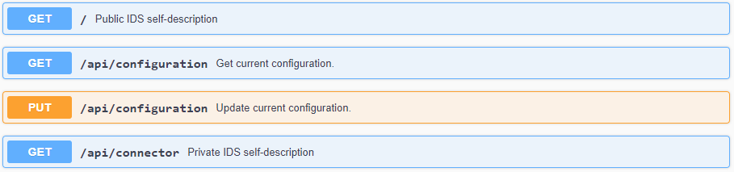
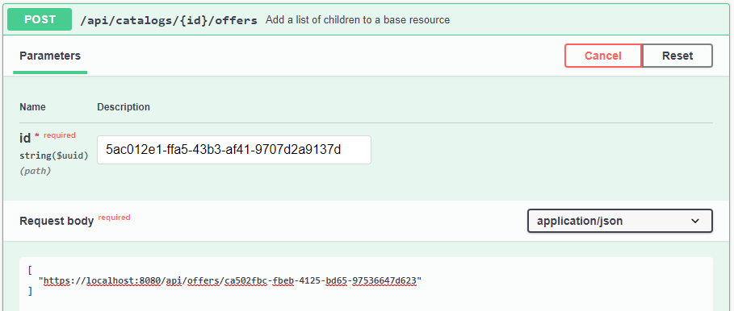

# Providing Data
{: .fs-9 }

See how to provide data with the Dataspace Connector.
{: .fs-6 .fw-300 }

---

First of all, the connector provides an endpoint for requesting its self-description.
The self-description is returned as JSON-LD string and contains several information about the running
connector instance. This includes e.g. the title, the maintainer, the IDS Informodel version, and
the resource catalog. At the public endpoint `/`, the resource catalog is not displayed. It can only
be accessed with admin credentials at `GET /api/connector` or by sending an IDS description request 
message as explained [here](consumer.md#step-1-request-a-connectors-self-description)).



## Step by Step

To understand the structure of a resource, please first take a look at the 
[data model section](../documentation/data-model.md) and the [REST API explanation](../documentation/rest-api.md). 
Then, for adding resources to the running connector as a data provider, have a look at the following 
steps.

In the following example, we want to provide the raw data from 
[here](https://samples.openweathermap.org/data/2.5/weather?lat=35&lon=139&appid=439d4b804bc8187953eb36d2a8c26a02)
to a data consumer.

### Step 1: Register Data Resources

The endpoint `POST /api/offers` can be used for registering a new resource offer at the
connector. This can be done by providing some important information as metadata in JSON format. An
example will be explained in the following. 

```
{
  "title": "Sample Resource",
  "description": "This is an example resource containing weather data.",
  "keywords": [
    "weather",
    "data",
    "sample"
  ],
  "publisher": "https://openweathermap.org/",
  "language": "EN",
  "licence": "http://opendatacommons.org/licenses/odbl/1.0/",
  "sovereign": "https://openweathermap.org/",
  "endpointDocumentation": "https://example.com",
  "key": "value"
}
```

```http request
curl -X 'POST' \
  'https://localhost:8080/api/offers' \
  -H 'accept: */*' \
  -H 'Content-Type: application/json' \
  -d '{
  "title": "Sample Resource",
  "description": "This is an example resource containing weather data.",
  "keywords": [
    "weather",
    "data",
    "sample"
  ],
  "publisher": "https://openweathermap.org/",
  "language": "EN",
  "licence": "http://opendatacommons.org/licenses/odbl/1.0/",
  "sovereign": "https://openweathermap.org/",
  "endpointDocumentation": "https://example.com",
  "key": "value"
}'
```

The values `title`, `description`, `keywords`, `publisher`, `sovereign`, `license`, etc. describe 
the data resource and will be used to fill in the IDS Information Model attributes for IDS 
communication with a connector as data consumer.

---

**Note**: If you need any further attributes, feel free to just type custom key value pairs. They
will be stored as `additional` inside the database - as shown in this example.

---

See the response of the previously registered resource below.

Response headers:

```
cache-control: no-cache,no-store,max-age=0,must-revalidate 
 connection: keep-alive 
 content-type: application/hal+json 
 date: Mon,17 May 2021 17:16:53 GMT 
 expires: 0 
 keep-alive: timeout=60 
 location: https://localhost:8080/api/offers/ca502fbc-fbeb-4125-bd65-97536647d623 
 pragma: no-cache 
 strict-transport-security: max-age=31536000 ; includeSubDomains 
 transfer-encoding: chunked 
 x-content-type-options: nosniff 
 x-frame-options: DENY 
 x-xss-protection: 1; mode=block 
```

If the resource was successfully registered, the endpoint will respond with `Http.OK` and the
location of the created resource within the response headers. 

Response body:
```json
{
  "creationDate": "2021-05-17T19:16:53.385+0200",
  "modificationDate": "2021-05-17T19:16:53.385+0200",
  "title": "Sample Resource",
  "description": "This is an example resource containing weather data.",
  "keywords": [
    "weather",
    "data",
    "sample"
  ],
  "publisher": "https://openweathermap.org/",
  "language": "EN",
  "licence": "http://opendatacommons.org/licenses/odbl/1.0/",
  "version": 1,
  "sovereign": "https://openweathermap.org/",
  "endpointDocumentation": "https://example.com",
  "additional": {
    "key": "value"
  },
  "_links": {
    "self": {
      "href": "https://localhost:8080/api/offers/ca502fbc-fbeb-4125-bd65-97536647d623"
    },
    "contracts": {
      "href": "https://localhost:8080/api/offers/ca502fbc-fbeb-4125-bd65-97536647d623/contracts{?page,size,sort}",
      "templated": true
    },
    "representations": {
      "href": "https://localhost:8080/api/offers/ca502fbc-fbeb-4125-bd65-97536647d623/representations{?page,size,sort}",
      "templated": true
    },
    "catalogs": {
      "href": "https://localhost:8080/api/offers/ca502fbc-fbeb-4125-bd65-97536647d623/catalogs{?page,size,sort}",
      "templated": true
    }
  }
}
```

Apart from the metadata, the response body contains links to itself and its parents and children.
A version number is generated automatically and is increased with every entity change, as well as
the creation and modification date.

The endpoints `PUT`, `GET`, and
`DELETE` `/offers/{id}` provide standard CRUD functions to read, update, and delete the metadata,
respectively the data resource - as described [here](../documentation/data-model.md).

Next to the resource, we need a catalog as a parent for the offer. Use `POST /api/catalogs` to 
create one. Its location is: [https://localhost:8080/api/catalogs/5ac012e1-ffa5-43b3-af41-9707d2a9137d](https://localhost:8080/api/catalogs/5ac012e1-ffa5-43b3-af41-9707d2a9137d). 
Then, we need to link both objects to each other via another endpoint. Therefore, we execute a `POST`
catalog's id extended by `/offers` and the resource's id as part of the list in the request body.



```http request

```

As a resource contains the metadata of a raw data string, it can contain several representations,
e.g. to describe different data types. By default, each resource must have at least one 
representation. Further details will be explained in Step 3. A representation can be created by 
using the endpoint  added to a 
resource by using the endpoint`POST /admin/api/resources/{resource-id}/representation`. See this example:

```
{
  "uuid": "55795317-0aaa-4fe1-b336-b2e26a00597f",
  "type": "JSON",
  "byteSize": 101,
  "name": "Example Representation",
  "source": {
    "type": "http-get",
    "url": "https://samples.openweathermap.org/data/2.5/weather?lat=35&lon=139&appid=439d4b804bc8187953eb36d2a8c26a02",
    "username": "",
    "password": ""
  }
}
```

The attributes `type`, `byteSize`, and `name` give detailed information about the data source. The
`source` object contains details for the data providing connector on how to retrieve the data from
connected backend systems or existing APIs (as Open Weather in the example). Here as well, you can
set your own representation id.

As for the resources, several endpoints provide CRUD operations for representations.


Further endpoints as `PUT` and `GET` `/contract` can be used to add and update the usage policy of
a resource without having to update the whole metadata model.

A resource must have at least one policy. By default, a `PROVIDE_ACCESS` pattern is added on each
created resource.

> **Note**: Since the IDS policy language is rather complicated and it is not trivial to create a
> valid policy by hand, endpoints are provided to obtain example policies
> (`POST /admin/api/example/usage-policy`) or to validate created strings (`POST /admin/api/example/policy-validation`).
>
> 


### Step 2: Add Data to the Internal Database

For adding plain data to the registered resource, take the returned uuid and upload a string with
`PUT /{resource-id}/data`. With `GET`, the same endpoint can be used to request the data.
> **Note**: With source type `local`, always the first representation will be loaded.

The endpoint `/{resource-id}/{representation-id}/data` can be used to request a specific representation of a resource, if multiple have been created.


### Step 3: Add Data from an External Database

To distinguish between internally and externally linked data, the resource representation provides
the property `source` and its attribute `type`. Based on the `type`, the connector knows how to
retrieve the data string on a data request. If it is set to `local`, the data will be loaded from
the internal database. Currently, the connector can further establish a connection with `http-get`,
`https-get`, and `https-get` with basic authentication. To setup `url`, `username`, and `password`,
the `source` class provides appropriate attributes.

In case an external REST API should be connected and this API usually expects query parameters from
the user, e.g. to retrieve the raw data in various formats, multiple representations can be created
for one resource. Each representation can then be connected to one specified http request or
database query with fix parameters. For this purpose, the connector provides CRUD operations for
`/representation`, which essentially correspond to those of a resource.

> **Note**: While the connector has the ability to store data resources internally, it never
> duplicates data connected by external systems into its internal memory. Instead, the data is only
> forwarded when a request is received. In addition, the backend connection credentials are never
> passed on to another connector, but are only used for internal data handling.

> **Note**: To build up a connection to a custom database endpoint, e.g. without using http REST,
> an interface for another source typ can be implemented and the method
> `OfferedResourceService.getDataString()` and linked methods edited accordingly.

### Step 4: Publish Resources at IDS Metadata Broker (optional)

For communicating with an IDS metadata broker, some endpoints are provided.
- `/broker/register` and `/broker/update`: send a `ConnectorUpdateMessage` with the connector's
  self-description as `payload`
- `/broker/unregister`: send a `ConnectorUnavailableMessage` to unregister the connector
- `/broker/update/{resource-id}`: update a previously registered resource
- `/broker/remove/{resource-id}`: remove a previously registered resource
- `/broker/query`: send a `QueryMessage` with a SPARQL command (request parameter) as `payload`


## Policy Enforcement

When the data provider receives an `ArtifactRequestMessage` from an external Connector, the
`ArtifactMessageHandler` checks the pattern of the policy that was added to the requested resource.
If the pattern matches one of the following five, an appropriate policy check is performed:
`PROVIDE_ACCESS`, `PROHIBIT_ACCESS`, `USAGE_DURING_INTERVAL`, `USAGE_UNTIL_DELETION`, or
`CONNECTOR_RESTRICTED_USAGE`.

Depending on the specified rules, the access permission will be set to true or false. If it is true,
the data provider returns the data. If not, it will respond with a `RejectionReason.NOT_AUTHORIZED`.

---

**Note**: The contract negotiation is enabled by default. To disable it, have a look at the
[configurations](../deployment/configuration.md#ids-settings).

---

## Resource Updates
