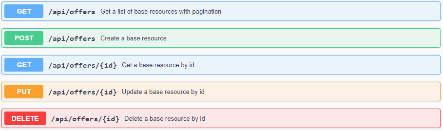
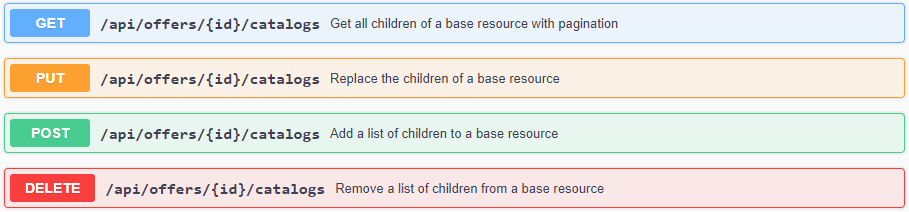
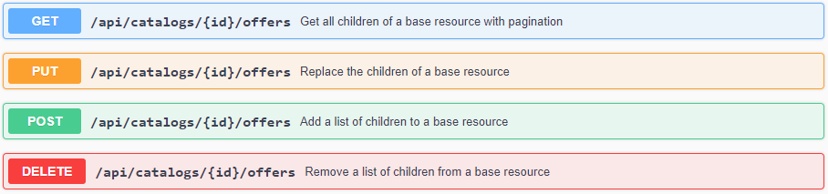

# REST API
{: .fs-9 }

Get to know the Dataspace Connector's REST API to automated resource handling.
{: .fs-6 .fw-300 }

---

If you haven't already checked it out, please first take a look at the Dataspace Connector data 
model [here](data-model.md). As mentioned there, the data model of the Connector is very modular. 
Relations between objects are predefined and via the REST API, a data offer can thus be created very 
dynamically. Individual objects can be detached from each other, attached to other objects, and 
modified at any time. 

CRUD endpoints allow the creation and modification of both individual entities and the relations 
between objects - starting from the child and the parent.

Endpoints for creating offered resources:

Endpoints for adding offers to catalogs:

Endpoints for adding offers to catalogs:

As described [here](../features/overview.md), the Dataspace Connector partly supports HATEOAS and 
returns correct response codes according to the HTTP1.1 standard (RFC 7231). The OpenApi 
documentation is provided within the repository and can additionally be created at runtime as 
explained [here](../deployment/build.md#maven).

The entry point for the REST API is located at `/api`. From there, you can easily navigate through 
the data model. 

The API supports pagination and each REST resource provides meta information about 
itself. This includes for example the self-link or parent and child information.

